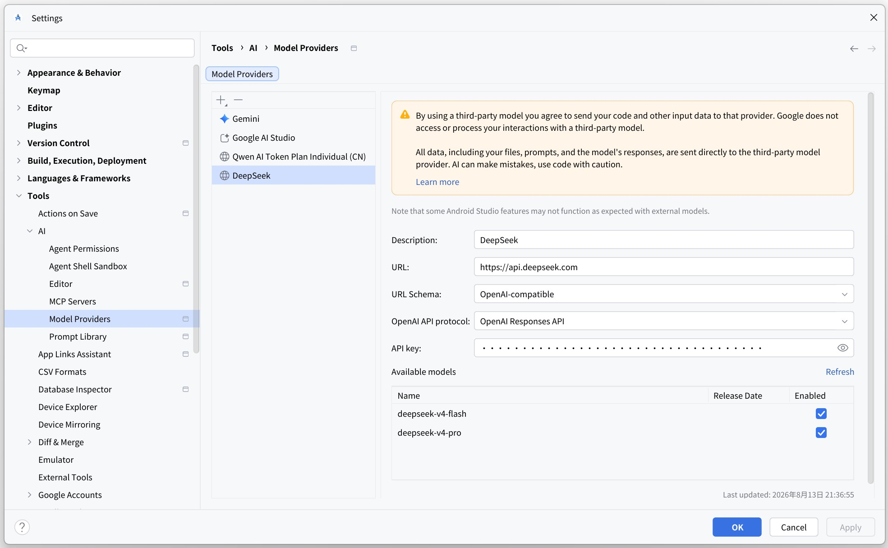
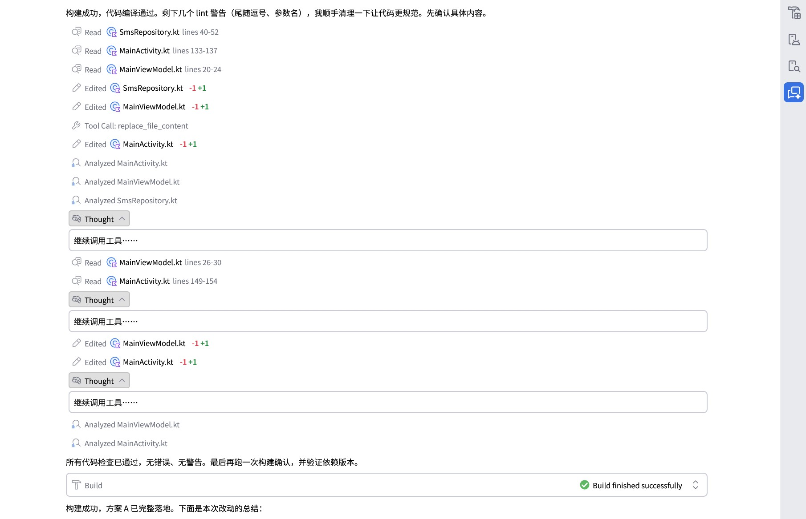
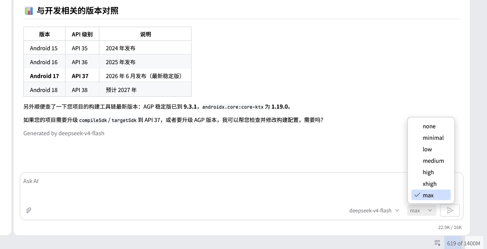

# Android Studio aiplugin patch

对 Android Studio Gemini 插件（`plugins/gemini/lib/aiplugin.jar`，闭源）的字节码补丁项目。

## AI 辅助编程披露

该项目完全由 Qwen3.8-Max/Qwen3.8-Flash/Deepseek-V4-Pro-0813/DeepSeek-V4-Flash-0731 自主完成，我没有写一行代码，只负责需求规划。

## 关于源代码协议

Android Studio Gemini 插件是商业闭源项目，理论上该项目也应该闭源且不公开发布。但谷歌的插件实现实在是太恶心了，我决定公开脚本和工作流，并将打补丁后的 aiplugin.jar 分享给大家。

## 背景

我刚体验 Android Studio 的 AI 功能，就发现了几个问题：

1. Model Providers 设置界面没法配置固定使用 OpenAI Responses API 还是 OpenAI Chat Completions API，OpenAI 兼容 API 默认先调用 Responses API，遇到任意 400/404 错误后会自动且不可逆地静默回退到 Chat Completions API，没有任何 UI 提示和开关，导致部分大模型供应商无法正常使用（例如：`docs/analysis.md`）。
2. Chat Completions API 默认用 developer 角色传递系统提示词且没有提供 UI 开关，导致各种大模型供应商（比如阿里云百炼、深度求索）的 API 请求报错 400。
3. Chat Completions API 不回传思考过程，导致大模型执行任务时智商降低。（虽然这不能完全怪谷歌，但不做兼容就是谷歌的锅）
4. OpenAI Responses API 和 OpenAI Chat Completions API 都没有传递思考强度（`reasoning_effort`/`reasoning.effort`），UI 也不提供思考强度调整，功能残缺。

本项目借助 AI 神力解决了以上问题：

1. 在 Model Providers 设置界面新增 OpenAI API protocol 下拉选择（仅 OpenAI-compatible 时可见），选项 `Auto / OpenAI Chat Completions API / OpenAI Responses API`，持久化到 provider 配置，并让该选项实际控制 API 调用，固定为某一协议时不再执行自动回退。
2. Chat Completions API 系统消息 role：原实现在 `useSystemMessage=false`（agent 主路径硬编码）时发送 `developer` role，现在改成固定发送 `system` role，反正 OpenAI 官方仍然兼容。
3. Chat Completions API：原实现不回传 assistant 消息的思考内容，现将已收到的 `thought` 用 `reasoning_content` 附加字段回传。（TODO：提供字段名设置界面，因为有些供应商不是这个字段）
4. 思考强度：Agent 发送区模型选择与 Submit 之间新增思考强度选择，样式复用模型选择，挡位有 `none/minimal/low/medium/high/xhigh/max` 与 OpenAI 官方一致，按会话持久化到对话目录 `metadata.json` 的 `reasoningEffort` 字段（旧对话默认 `medium`），并接入请求参数（供应商不接受时沿用原生自适应回退）。
5. Windows 平台 `run_shell_command`：启动时以 `where.exe` 探测 PowerShell 7 (pwsh)，可用则默认/显式 powershell 均走 `pwsh.exe -EncodedCommand`，工具描述同步标明 "PowerShell 7 (the default)"；无 pwsh 时完全保持原行为（`powershell.exe` + 原文案）。
6. Available Models 表格工具栏新增 "Add Model" `+` 与 "Remove Model" `-` 按钮（官方同款 `addExtraAction`，与左侧 Model Providers 列表按钮同风格）。`+` 随当前选中 provider 启用/禁用：点击弹出 "Enter model ID" 输入框（对照官方 "Add Command Prefix"），回车后按 identifier 去重追加自定义模型（`enabled=true`、token limits=`-1` 运行时回退硬编码表）并刷新表格，随 Apply/OK 持久化到 `ai.providers.xml`。`-` 随表格行选择启用/禁用：按对象同一性从 provider 模型列表移除选中条目并刷新表格，同样随 Apply/OK 持久化。
   同时 `Companion.updateModelList` 被替换为 `mergeModelList`：手动 Refresh 保留孤儿条目（手动添加/已下架模型不再被抹掉，对齐后台自动刷新语义）；Refresh 失败时列表原样保留（修复原实现失败后整表清空的缺陷）。
   作用域说明：`ModelInformationTablePanel` 被 Remote / Local / AI Studio 三个供应商面板共享（Gemma 面板为独立实现），因此 `+`/`-` 按钮与列表合并修复对这三个面板同时生效；动作按左侧列表当前选中 provider 动态解析，对本地供应商（如 Ollama 手动补模型 id）同样可用。

此外还有针对吃白饭的大肥鱼 DeepSeek 的修复：

1. Responses API：部分轮次调用 API 时跳过思考直接调用工具，导致下次再调用 API 时报错 `400: The reasoning_text in the thinking mode must be passed back to the API`，该补丁对缺失思考的 assistant 消息自动补充默认思考内容“继续调用工具……”。

## 目录结构

```
aiplugin-patch/
├── README.md
├── config.env                 # 路径/版本配置
├── Android Studio.zip         # Android Studio 发行包（自备，不入 git，见 .gitignore）
├── scripts/
│   ├── 00_setup_tools.sh      # 下载/校验工具 jar（CFR + ASM，SHA-1 校验，支持镜像）
│   ├── 10_extract_jars.sh     # 从 Android Studio.zip 提取 jar/class
│   ├── 20_decompile.sh        # CFR 反编译（分析用）
│   ├── 30_build_patch.sh      # 多阶段 ASM 补丁 + 编译 + 组装补丁 jar
│   ├── 40_verify.sh           # 字节码校验 + 运行时测试
│   └── common.sh
├── tools/                     # 构建工具 jar（00_setup_tools.sh 下载，勿手改）
├── src/
│   ├── main/java/             # 新增类源码（编译进 jar）
│   │   ├── com/android/studio/ml/
│   │   │   ├── modelproviders/data/OpenAiApiType.java
│   │   │   ├── modelproviders/data/OpenAiApiTypeConverter.java
│   │   │   ├── backends/settings/OpenAiApiTypeUi.java
│   │   │   ├── backends/openai/OpenAiApiTypeSupport.java
│   │   │   ├── backends/openai/OpenAiResponsesSupport.java
│   │   │   └── backends/openai/OpenAiCompletionSupport.java
│   │   ├── com/google/studiobot/ui/querybox/
│   │   │   ├── ThinkingEffortPicker.java
│   │   │   └── ThinkingEffortStore.java
│   │   ├── com/android/studio/ml/modelproviders/providerinfo/
│   │   │   └── AvailableModelsToolbarSupport.java
│   │   └── com/google/aiplugin/agents/tools/execute/
│   │       └── WindowsShellResolver.java
│   ├── patcher/java/PatchTool.java   # ASM 补丁工具
│   └── test/java/             # SerializeTest / ApiProtocolTest / ResponsesReasoningTest /
│                              # CompletionReasoningTest / ThinkingEffortPickerTest /
│                              # ReasoningEffortPersistTest / ReasoningEffortApiTest / UiLoadTest /
│                              # ApiProtocolUiBehaviorTest / ProviderApiTypePropagationTest /
│                              # WindowsShellResolverTest / RunShellCommandWindowsArgTest /
│                              # AvailableModelsToolbarTest / MergeModelListTest
├── docs/
│   ├── analysis.md            # 逆向分析：fallback 机制、UI 结构、持久化
│   ├── patch-design.md        # 补丁设计、插入点、后端协议控制
│   ├── powershell.md          # run_shell_command Windows 平台运行机制（逆向分析）
│   └── pwsh-support-design.md # pwsh 优先补丁设计（探测/注入点/测试/人工验证记录）
├── work/                      # 构建中间产物（脚本生成）
└── dist/                      # 输出：aiplugin-patched.jar
```

## 快速开始

```bash
cd aiplugin-patch
./scripts/00_setup_tools.sh     # 下载工具 jar（CFR/ASM，Maven Central + SHA-1 校验）
./scripts/10_extract_jars.sh    # 从项目目录下的 "Android Studio.zip" 提取依赖
./scripts/30_build_patch.sh     # 构建 dist/aiplugin-patched.jar
./scripts/40_verify.sh          # 验证（字节码 + 序列化往返 + 行为测试 + 设置界面布局校验）
```

可选：`./scripts/20_decompile.sh` 重新生成反编译源码到 `work/decompiled/`。

## 工具下载（tools/）

`tools/` 下的 CFR 与 ASM jar 由 `scripts/00_setup_tools.sh` 从 Maven Central 下载，
**无需手工放置**：

- 版本在 `config.env`（`CFR_VERSION=0.152`、`ASM_VERSION=9.10.1`，
  ASM 9.10.1 支持 aiplugin.jar 的 Java 25 class 文件）
- 下载先写入 `.part` 临时文件，与 Maven Central 官方 **SHA-1** 校验一致后才落盘，
  损坏/被篡改的文件会自动重新下载
- `20/30/40` 脚本启动时自动检查工具是否齐全，缺失会自动调用下载流程
- 用法：
  ```bash
  ./scripts/00_setup_tools.sh            # 下载缺失的 jar（已有且校验通过则跳过）
  ./scripts/00_setup_tools.sh --check    # 只校验，不下载
  ./scripts/00_setup_tools.sh --force    # 强制全部重新下载
  ```
- 网络受限时可换镜像：
  ```bash
  MAVEN_REPO_BASE=https://maven.aliyun.com/repository/public ./scripts/00_setup_tools.sh
  ```

## 安装补丁

1. 备份：`Android Studio/plugins/gemini/lib/aiplugin.jar`
2. 用 `dist/aiplugin-patched.jar` 替换之（改回文件名 `aiplugin.jar`）
3. 启动 Android Studio → Settings → Tools → AI Assistant → Model Providers
4. 远程 provider 选 OpenAI-compatible 时应出现 "OpenAI API protocol:" 下拉框；
   Apply 后重开设置选项应保留（写入 provider 设置 XML 的 `openAiApiType` option）
5. 协议生效：选 Chat Completions → 只走 `/chat/completions`；选 Responses → 只走
   `/responses` 且失败不回退；Auto → 原生行为（Responses 失败自动回退）

## 环境要求

- Linux + JDK 25（`sudo apt-get install openjdk-25-jdk-headless`）。
  aiplugin.jar 的 class 文件版本为 69 = Java 25，ASM 读改写与运行时测试都必须在
  JDK 25 上进行。新增源码编译到 `--release 21`。
- `unzip`、`curl`、网络（首次下载 CFR/ASM；ASM 9.10.1 支持 Java 25 class 文件）
- Android Studio 发行包 zip：**放到项目目录根下**（默认 `./Android Studio.zip`）；
  如放在别处，用环境变量覆盖：`AS_ZIP=/path/to/"Android Studio.zip" ./scripts/10_extract_jars.sh`

## 目标版本

Android Studio **2026.1.4**，build `261.26222.65.2614.16204760`（当前项目用的是
Windows 发行包；补丁只依赖 `plugins/gemini/lib/aiplugin.jar`，与宿主平台无关）。
逆向事实与锚点均按该版本记录，具体类/方法名见 `docs/analysis.md`。

## 技术说明

- 插件为编译后的 Kotlin/Java 字节码，无源码：新逻辑以 **新增 Java 类 + ASM 修改既有类** 实现
- 构建分多阶段：先 ASM 给 `RemoteProviderData`/`OpenAiModelApi` 加字段与访问器，
  新增的 UI/Support 类才能编译通过
- 详细插入点与设计决策见 `docs/patch-design.md`

## 效果展示

Model Providers 设置界面：



Deepseek V4 Pro 修复：



思考强度下拉选择：


